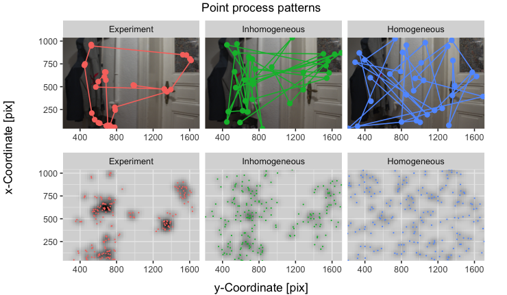
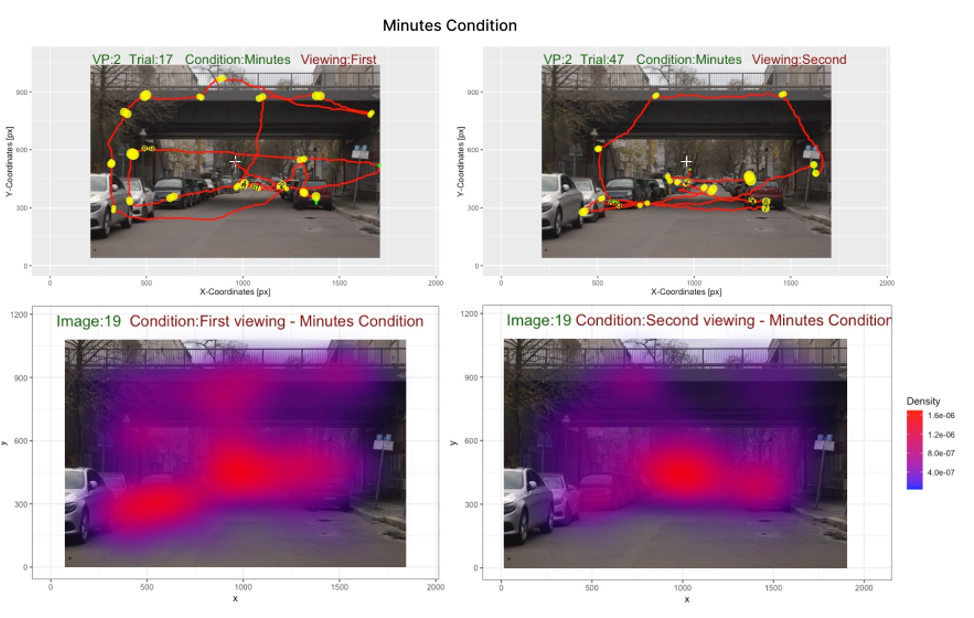
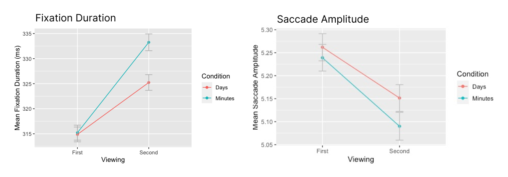

# Eye movement analysis

## Introduction
This project investigates the relationship between memory for familiar scenes and eye movement behavior, with a specific focus on the persistence of the image familiarity effect over longer time scales. The image familiarity effect refers to the phenomenon where individuals exhibit longer fixation duration and shorter saccade amplitude when viewing familiar images. The main objective of this study is to determine if this effect persists over longer time scales, such as weeks or months, and to clarify if the effect emerges due to visual long-term memory or other mechanisms. The project includes an eye-tracking experiment where participants observe images while their eye movements are recorded, and the data collected is analyzed using statistical methods. The findings of this study have potential implications for fields such as visual perception and cognitive psychology.

## Tools

The project was implemented using Matlab R and the following libraries:

* `Microsaccade Toolbox`
* `spatstat`
* `dplyr` for data cleaning and manipulation
* `tidyr` for data reshaping
* `ggplot2` for data visualization
* `lme4` for mixed-effects modeling
* `car` for model diagnostic and post-hoc analysis

## Data Collection

The eye-tracking data was collected using an Eyelink 1000 desktop mounted eye tracker. Participants observed new and familiar images in two experimental sessions, one week apart from each other. The experiment was programmed in MATLAB and consisted of two blocks: memorization and recall.

## Data Preprocessing

In order to prepare the data for further analysis, we first conducted saccade detection using the velocity-based algorithm proposed by Engbert & Kliegl (2003), which utilizes the saccades’ specific property - linear relationship between peak velocity and amplitude. In order to conduct the saccade detection, we used the Microsaccade Toolbox for R developed by Engbert et al.(2015). 
Another step of the data preprocessing was elimination of outliers for dependent variables. As the result, we set limit for minimal and maximal values for dependent variables.

## Analysis

The data collected was analyzed using a combination of statistical methods, including pair correlation function (PCF) analysis and linear mixed-effects modeling (LMM).

### Pair Correlation Function

In order to investigate the influence of image familiarity effect on the eye movement behavior, the pair correlation function analysis was applied to the eye movement data. The pair correlation function (PCF) is a method from spatial statistics and can be used to study and compare spatial correlations between fixations under different viewing conditions. The PCF analysis for fixation locations was implemented in R using the `spatstat` package.

First, we simulated two control point processes (homogeneous and inhomogeneous) to ensure that correlations in the PCF arise from the empirical data. To do so, we estimated fixation density for each image using the data from all participants. Once the fixation density was estimated, individual scanpaths for the inhomogeneous and homogeneous point processes were simulated using the computed density.

Next, in order to compute PCF, one needs to choose an optimal bandwidth for the intensity estimation of PCF. This step was implemented by varying bandwidths, computing PCFs for them, and calculating the deviation from complete spatial randomness of the average PCF of an image. We varied bandwidths from 0.1° to 10° with a step size of 0.1°. The bandwidths that yielded the smallest deviation of PCF from complete spatial randomness, were taken for further intensity estimation of the pair correlation function.

The final step implied computing PCF for each image viewed for the first and second time under minutes and days conditions. The optimal bandwidth that resulted in the smallest deviation from complete spatial randomness of the PCF was used to compute pair correlation functions. 

As the result, PCF analysis demonstrated that repeated viewing resulted in increased PCFs and, thus, more abundant fixation locations in both minutes and days conditions.

In order to further demonstrate that fixations are more strongly aggregated during the second viewing compared to the first one, we obtained heatmaps that show distributions of gaze points produced by all participants in different experimental conditions, where colors vary with the density of the number of fixations.

As one can see, the distribution of fixations in the first observation is more spread over the scene, while in the second viewing, fixations are directed to regions of interest.

### Linear Mixed-Effects Modeling

To further explore the relationship between image familiarity and eye movement behavior, linear mixed-effects modeling (LMM) was used to model the effect of image familiarity on fixation duration and saccade amplitude. The lme4 package in R was used to fit the LMMs, which allowed for the modeling of both fixed and random effects, taking into account the within-subject and between-subject variation in the data. The car package was also used for model diagnostic and post-hoc analysis.

At the first inspection, there is a visible difference in both fixation durations and saccade amplitudes between the first and second viewing in both conditions. Although the effect exists in both conditions, it is clear that in minutes condition it has a larger magnitude that in days condition.

As the result, the linear mixed effect analysis revealed a strong significant effect of viewing for both fixation duration and saccade amplitude. This result indicates that both dependent variables differed significantly between the first and second observations on short and long time scales. We found no significant effect of condition and interaction between condition and viewing for fixation duration and saccade amplitude. The former suggests that on average participants reacted identically to images in minutes and days conditions. The latter confirms that there was no difference in reaction patterns to new versus familiar images between minutes and days conditions.

## Conclusion

The current study aimed to investigate the impact of long-term memory on eye movement behavior. Through the use of an eye-tracking experiment, we sought to determine whether the image familiarity effect persisted over longer time scales as visual long-term memory does.

Our results showed that the image familiarity effect was present on both short and long time scales, with participants exhibiting longer fixation durations and increased pair correlation function for familiar images. However, the effect was weaker when images were repeated over a week interval, potentially due to decaying representations stored in visual long-term memory.

Overall, this study provides evidence for the persistence of the image familiarity effect over longer time scales, indicating that it is likely driven by visual long-term memory. However, further research is needed to fully understand the complex relationship between memory and eye movement behavior.
 
## Acknowledgements

I would like to extend my sincere appreciation to my supervisors, Prof. Dr. Ralf Engbert, Lisa Schwetlick, and Daniel Backhaus for their guidance, mentorship, and support throughout this project. Their valuable insights, expertise, and constructive feedback have been instrumental in shaping the direction and outcome of this study. Their unwavering encouragement and support have been a source of inspiration and motivation. I am deeply grateful for the opportunity to work under their guidance and for the invaluable experience gained from this project. I would like to thank them for their dedication, time, and patience throughout the project.
